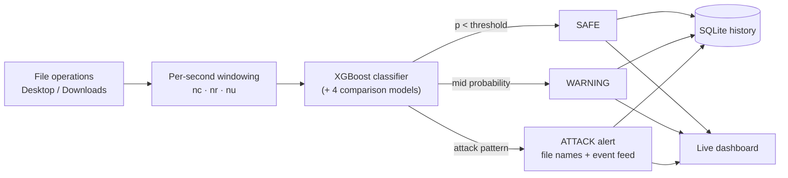

# Ransomware Detection System
### Server-Side File Operation Monitoring with Machine Learning


A real-time ransomware detection system based on the paper by **Aranyi, G., Miseta, T., & Szucs, V. (2026)** — *"Ransomware detection based on server-side file operation logs using machine learning"*, Journal on Information Security, 2026:8.

---

## Overview

This system monitors file operations on your Desktop and Downloads folders in real-time, using machine learning to detect ransomware behavior patterns. It analyzes three features per 1-second window:

| Feature | Description |
|---------|-------------|
| **nc** | Number of file create operations |
| **nr** | Number of file rename operations |
| **nu** | Number of file delete operations |

Five ML models classify each window as benign or attack:
- Random Forest (RF)
- Support Vector Machine (SVM)
- Decision Tree (DT)
- AdaBoost (ADA)
- **XGBoost** (primary classifier)

## Features

- **Two Operation Modes:**
  - **Simulation Mode** — Generates synthetic file operations with simulated ransomware attacks (Ryuk, WannaCry, NotPetya, LockBit, TeslaCrypt)
  - **Real Monitor Mode** — Watches your actual Desktop/Downloads folders using Windows OS-level notifications (completely read-only)

- **Real-time Dashboard** with:
  - Live operation counters (create/rename/delete per second)
  - XGBoost probability gauge with threat levels
  - Operation timeline chart (Chart.js)
  - Model comparison table (all 5 models with live predictions)
  - Live confusion matrix + Test-set confusion matrix
  - Alert log with affected file names
  - Event feed showing actual file paths
  - Adjustable speed (1x / 3x / 5x / 10x)

- **ML Pipeline:**
  - Auto-trains on first run if no saved models exist
  - GridSearchCV hyperparameter optimization
  - Models saved/loaded from disk for fast startup
  - CalibratedClassifierCV for reliable probability estimates

## Installation

```bash
# Clone the repository
git clone https://github.com/methila-2056/Ransomware-Detection-Server-Side-File-Logs-ML-Models.git
cd Ransomware-Detection-Server-Side-File-Logs-ML-Models

# Install dependencies
pip install -r requirements.txt

# Run the application
python app.py
```

Open **http://localhost:5000** in your browser.

## Project Structure

```
├── app.py                  # Flask + SocketIO server (dual mode)
├── simulation.py           # File operation simulator
├── real_monitor.py         # Watchdog-based folder observer
├── ml_engine.py            # 5 ML models with training pipeline
├── database.py             # SQLite storage layer
├── requirements.txt        # Python dependencies
├── templates/
│   └── index.html          # Dashboard UI (TailwindCSS)
└── static/
    ├── css/style.css       # Cyber theme + animations
    └── js/dashboard.js     # Real-time dashboard logic
```

## How Detection Works



The ML models are trained on ratio patterns:
- **Normal behavior**: Low-moderate creates, few renames, few deletes
- **Ransomware behavior**: High creates + high renames + high deletes simultaneously

## Technology Stack

- **Backend:** Python, Flask, Flask-SocketIO
- **Frontend:** TailwindCSS, Chart.js, Socket.IO
- **ML:** scikit-learn, XGBoost
- **Monitoring:** watchdog (Windows ReadDirectoryChangesW)
- **Storage:** SQLite

## Reference

> Aranyi, G., Miseta, T., & Szucs, V. (2026). Ransomware detection based on server-side file operation logs using machine learning. *Journal on Information Security*, 2026:8.

## License

This project is for educational and research purposes.
